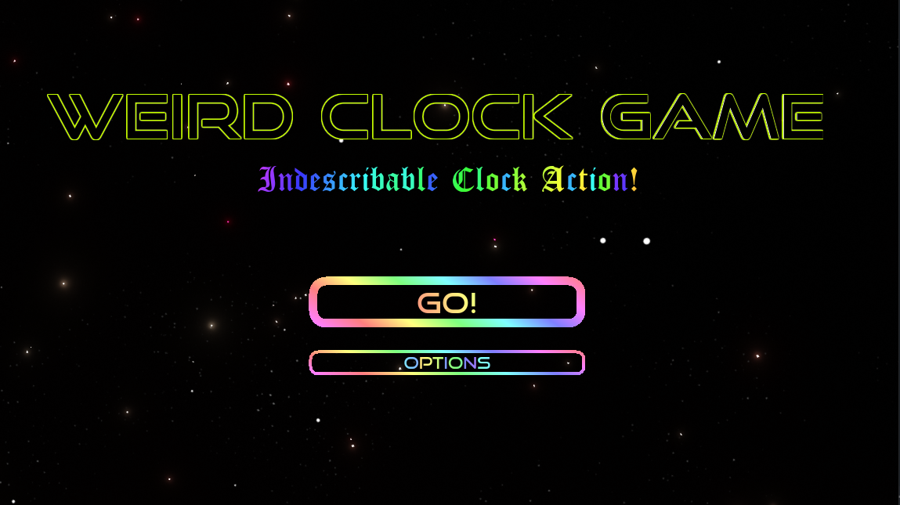

# Weird Clock Game

[Play on Itch.io](https://deplicator.itch.io/weird-clock-game)

[Game Play Video](https://www.youtube.com/watch?v=mRc2Gb_gocE)

## Controls

| Action                | Keyboard             | Controller            | Touch Screen           |
|:----------------------|:---------------------|:----------------------|:-----------------------|
| **Clockwise**         | right arrow or D key | d-pad or either stick | right third of screen  |
| **Counter Clockwise** | left arrow or A key  | d-pad or either stick | left third of screen   |
| **Surge**             | space bar            | any standard button   | middle third of screen |

## Documents

Both documents may contain story spoilers.

- [Plan](./documents/PLAN.md)
- [Story](./documents/STORY.md)

## Credits

- Menu Music: <https://pixabay.com/music/introoutro-background-loop-straight-04-2699/>
- Game Music: <https://pixabay.com/music/synthwave-the-80s-retrowave-synthwave-143303/>
- Action start/end sounds: <https://opengameart.org/content/sfx-plug-in-plug-out>
- Defender hurt sounds: <https://opengameart.org/content/pain-sounds-by-emopreben>
- Ring enemy death sounds: <https://opengameart.org/content/512-sound-effects-8-bit-style​>
